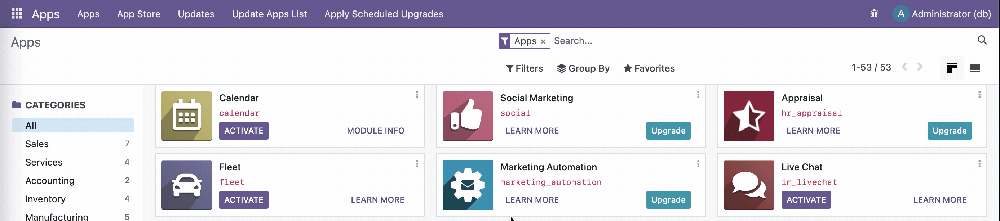

# Add-ons and Modules
Add-ons can be viewed as "modules" in a particular Odoo instance. In the [Using Odoo](using.md) section, we already have accessed the dashboard or the "Apps" page, which displayed numerous items like *Sales*, *Invoicing*, and so forth. These items are also add-ons of their own.

Add-ons are not necessarily applications seen in this page by default. They could be used to aid in the Odoo instance by whatever purpose the developer wants to carry it out with.

## Displaying All Add-ons Present
While in **debug mode** in the dashboard, simply head to the search field for the apps and press `Backspace` to remove the *Apps* filter. This will display all add-ons present in the Odoo instance.

As shown, add-ons that aren't applications but come with the default Odoo instance do not show a dedicated icon but rather, a generic, outlined cube. It can also be seen that the number of items on the sidebar filtering all the add-ons by categories will increase.

## File Locations
### Built-in Add-ons
In our Odoo instance run with Docker, it comes bundled with add-ons, some of which are required to be explicitly activated from the Apps page. These add-ons are located in this directory of our container:
````bash
/usr/lib/python3/dist-packages/odoo/addons
````

### Custom Add-ons
Custom add-ons are user-defined or are developed independently of Odoo. Traditionally, one has to define the path of a folder where the custom add-ons will be placed in their Odoo `.conf` file. This is by convention as custom add-ons can still be placed in the same directory as the built-in add-ons, but it will mix up with the built-in ones.

In our Docker setup, it already has been setup for us. The custom add-ons are located in this directory of our container:
````bash
/mnt/extra-addons
````
Odoo sees this as another add-ons folder, and are read the same as the built-in ones.

Alternatively, the `extra-addons` folder can be found in one of the Volumes in Docker that has this file structure:
````bash
<VolumeHash>
├── __init__.py
├── __manifest__.py
├── controllers
├── demo
├── models
├── security
└── views
````
This volume is completely synonymous to `/mnt/extra-addons` in the Odoo container.

## Copying Add-ons

This action involves the use of the `docker cp` command.

### Host-to-Container
````bash
docker cp <host-path> odoo:/mnt/extra-addons
````
Where `<host-path>` is the path to the add-on in your local machine.

For example, if I developed an add-on `cashiering` from my Desktop and wanted to add this as a custom add-on to my Odoo instance, then:
````bash
docker cp /Users/User/Desktop/cashiering odoo:/mnt/extra-addons
````

### Container-to-Host
````bash
docker cp odoo:<path-inside-container> <host-path>
````

Suppose I wanted to inspect the `sale` add-on built-in into Odoo and have a copy of it in my Desktop, then:
````bash
docker cp odoo:/usr/lib/python3/dist-packages/odoo/addons/sale /Users/User/Desktop
````

