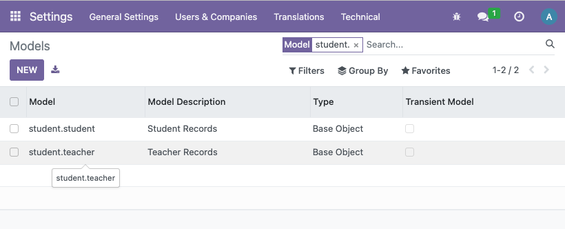
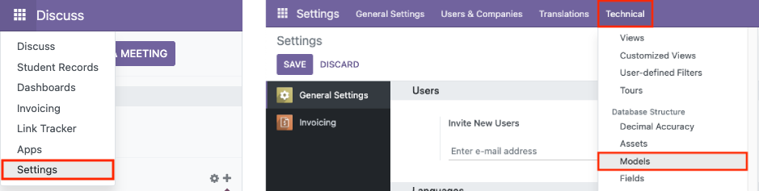
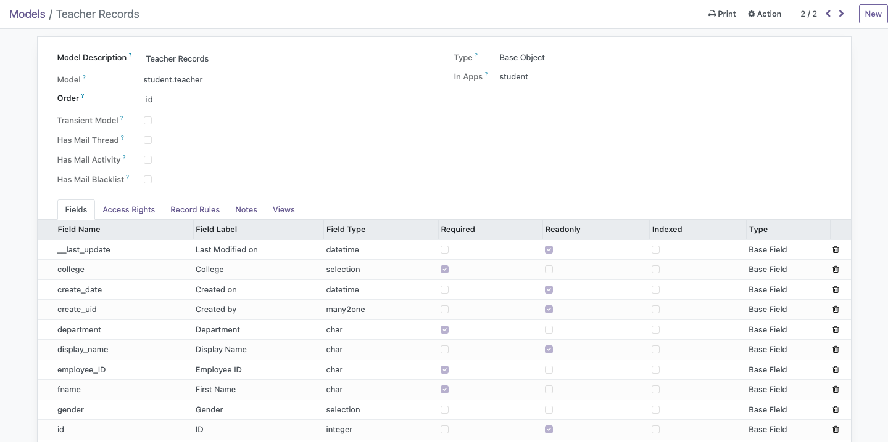

# Models
In this context, models represent the structure of the tables in the database. This is the same as doing `CREATE TABLE ... (attr type())` in SQL. Many frameworks as of this writing have a way to define the models in code and let the framework do the heavylifting of actualizing the tables you hardcoded into the database.

In the previous section, scaffolding already did the heavy work of setting up our directories and Python files and manifests. So let's start defining and tweaking these boilerplate code to our liking, starting with our models.

From this point, we'll be focusing on the `models` folder located in the root of our model directory

## The `__init__.py` file
In its pure boilerplate state, the contents of this file is as follows:

````python
# -*- coding: utf-8 -*-

from . import models
````

Currently, it is importing the `models.py` file (yes, without the need for the `.py` extension). While we can define all of our models in one file, you can have it by convention of modularizing all your models by separate Python files.

For instance, if I want to create a model for a student and a teacher with `student.py` and `teacher.py` files in the models directory, then the `__init__.py` file would be:

````python
from . import student
from . import teacher
````

## Defining Models
For the sake of documentation, we will have our hands-on on the already made `models.py` file in the directory.

The contents of the file are already commented and structured for you to get started and understand the convention of defining attributes for a model (or an entity) in our database, as shown here in this sample snippet (for example, when I scaffold a `teacher` model):

````python
# -*- coding: utf-8 -*-

# from odoo import models, fields, api


# class teacher(models.Model):
#     _name = 'teacher.teacher'
#     _description = 'teacher.teacher'

#     name = fields.Char()
#     value = fields.Integer()
#     value2 = fields.Float(compute="_value_pc", store=True)
#     description = fields.Text()
#
#     @api.depends('value')
#     def _value_pc(self):
#         for record in self:
#             record.value2 = float(record.value) / 100
````

Here's a breakdown of this snippet, which will be the basis of making models in Odoo, *more-or-less*:

* **`class teacher(models.Model):`** - Syntax for defining a model, where `teacher` is the name of such model. The rest are constant and are fixed.

* **`_name`** - Name of the model. With the parameter you named when you scaffolded for a model, that is the first part of the name followed by the name of the entity relevant to this module *(`teacher` is the name of our module, `teacher` is the name of the entity within this module, so `teacher.teacher`.)*'

* **_`description`** - Description of the model. This appears in Odoo under **Menu > Settings > Technical > Database Structure > Models** (which will be discussed later!)


The rest of the code are the attributes. They follow a pattern of syntax as follows:
````
<attribute_name> = fields.<type>(<options>)
````

**[A comprehensive list of field types are available here in Odoo's official documentation](https://odoo-development.readthedocs.io/en/latest/dev/py/fields.html)**

**[Also here for the complete list of <options\>](https://odoo-new-api-guide-line.readthedocs.io/en/latest/fields.html)**

Here's an example of attributes that can be related to our teacher entity, for example:
````python
name = fields.Char(string="First Name", required=True)
gender = fields.Selection([('male', 'Male'), ('female'), ('Female')]) # did not hardcode 'required=True', which means this attribute is optional
birthdate = fields.Date(string="Birthdate")
years_of_experience = fields.Integer(string="Years of Experience")
salary = fields.Float(string="Salary", digits=(10, 2), required=True)
````

## Checking Models
For every edit you do in your add-ons, restarting Odoo is a must if you want to see your changes in your Odoo instance. This can be achieved in the terminal:
```bash
docker stop odoo
docker start -a odoo
```
Afterwards, it is necessary to **upgrade** your module to reflect the changes made.


The upgrade is successful if it takes a while before reloading you back to the Discuss page (or whichever is the default landing page in the Dashboard). A modal will be shown with an error log if it fails.

Afterwards, you navigate to **Menu > Settings > Technical > Database Structure > Models** and search for your add-on or model name.



Clicking on a model will also have a list of all the attributes you have supposedly defined, alongside with attributes that Odoo automatically adds:

