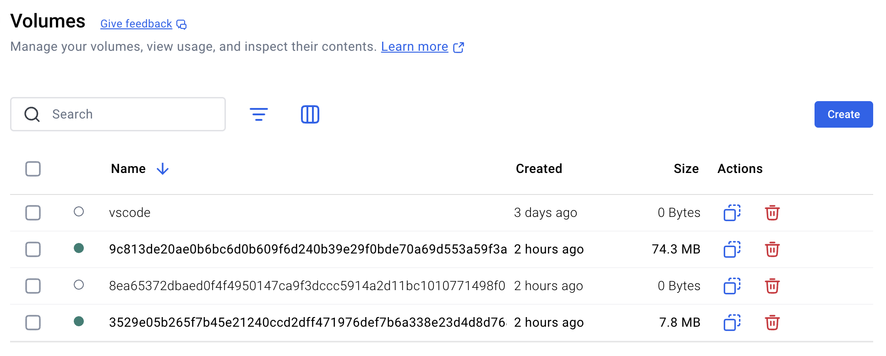
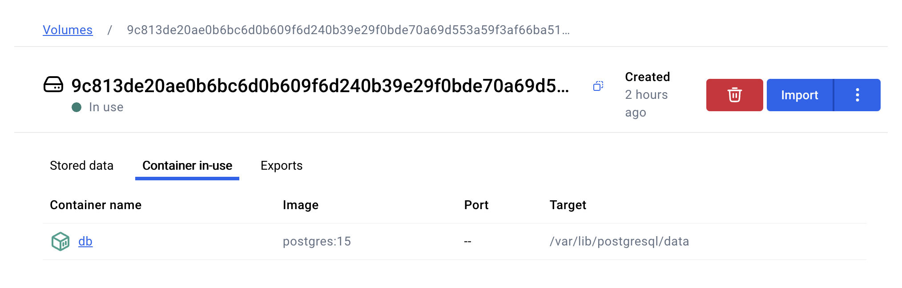

# Installing Odoo with Docker

## Prerequisites

* Docker Desktop (includes Docker CLI)

## Installation Proper

[Reference](https://hub.docker.com/_/odoo)

1) Install and run a PostgresSQL container:
````
docker run -d -e POSTGRES_USER=odoo -e POSTGRES_PASSWORD=odoo -e POSTGRES_DB=postgres --name db postgres:15
````

2) Install and run an Odoo instance and make sure to have the tag as **`-t odoo:16.0`** with an appended `:16.0` (for projects that require a specific version of Odoo to be developed on):
````
docker run -p 8069:8069 --name odoo --link db:db -t odoo:16.0
````
3) Visit [127.0.0.1:8089](http://127.0.0.1:8069) or whichever local IP was assigned with port number 8069

## Docker Crash Course
### Start and Stop an Instance/Container

Above, we set up an Odoo container with the tag `odoo:16.0`, hence the name of the container we made is `odoo`
````
docker stop odoo
docker start -a odoo
````

### Delete a Container
Should you wish to delete the odoo container if you run to an error that an already existing container with the `odoo` name already taken, get its container ID with
````
docker ps -a
````

A sample output would be:
````
CONTAINER ID   IMAGE            COMMAND                  CREATED       STATUS                   PORTS                                   NAMES
ef3535b3afe3   da2782e8f015     "/bin/sh -c 'echo Co…"   2 hours ago   Exited (0) 2 hours ago                                           cranky_haslett
7d0d5b20d3d0   odoo:16.0        "/entrypoint.sh odoo"    2 hours ago   Up 2 hours               0.0.0.0:8069->8069/tcp, 8071-8072/tcp   odoo
93ca78717132   postgres:15      "docker-entrypoint.s…"   2 hours ago   Up 2 hours               5432/tcp                                db
````

In this case, `7d0d5b20d3d0` is the container ID of the Odoo instance, which is indicative of the image used, `odoo:16.0`.
Stop the container, then delete it:
````
docker rm 7d0d5b20d3d0
````

### Delete a Volume
In [Installation Proper](#installation-proper), we executed `docker run` for both PostgreSQL and Odoo, which created two volumes with arbitrary names, as the case here in this sample screenshot in Docker Desktop.

To verify which volume point to which container, for example in Docker Desktop, click on a volume then **Container-in-use** tab. In this example, this volume with a starting id of `9c813de` is the volume for our PostgreSQL container.

In Docker Desktop, you can drop the Postgre database and/or delete the entire Odoo instance by clicking on the red **Trash** icon, either from Volumes tab or the view of the container itself.
