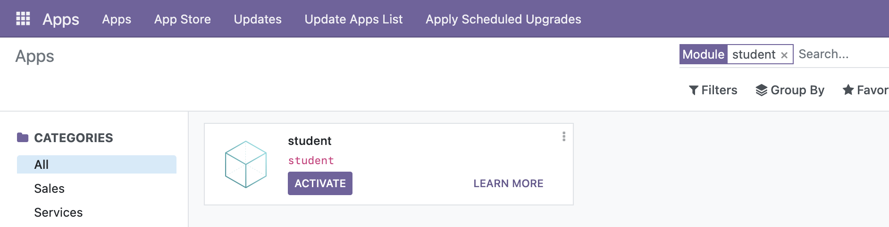

# Creating (Scaffolding) an Add-on
Just like in numerous frameworks that involve databases, **scaffolding** refers to the process of making a "skeleton" or "structure". In fact, this does not only revolve databases alone but encompasses anything that involves the making of a readymade, more-or-less structure (just like a template or boilerplate code).

In Odoo, an addon can be scaffolded. This takes care of setting up all the files an add-on needs without the need of manually creating those files.

In a traditional setup of Odoo, the way to scaffold an add-on is:
````bash
odoo-bin scaffold <name> <path>
````
Where `<name>` is the name of the add-on and `<path>` is the path to where the add-on will be created.

In a Docker setup, the command is slightly different. The command to scaffold an add-on in a Docker setup is:
````bash
docker exec <container-name> odoo scaffold <name> /mnt/extra-addons
````
`/usr/bin/odoo` is analogous to `odoo-bin` above, which is nested under a command, `docker exec` which calls docker to execute whatever shell command is appended before it.

* `<name>` still refers to the name of the add-on.
* `/mnt/extra-addons` is a fixed path where all of the extra or custom add-ons will be added. In Docker, this is a volume where it cooperates with the Odoo container alongside the second volume which handles the Postgre container (the container that is being demonstrated to delete in [Odoo + Docker/Delete a Volume](install.md/#docker-crash-course)).

For example, to create a custom "student" add-on, the command would be:
````bash
docker exec odoo odoo student /mnt/extra-addons
````
Where `odoo` is the name of the Odoo container and `student` is the name of our add-on.

Afterwards, you can find the volume where this file structure resembles the following in Docker Desktop under the Volumes view from the sidebar:

As shown, the model that we scaffolded, `student` is present in the root of this directory. You can further verify that this is inside `/mnt/extra-addons` by inspecting the file structure of your Odoo container.

## Importing an Add-on to the Odoo Container
As per the official README in the Odoo DockerHub repository, the command to import an add-on to the Odoo container is:
````bash
docker run -v /path/to/addons:/mnt/extra-addons -p 8069:8069 --name odoo --link db:db -t odoo
````

Where `/path/to/addons` may be an individual folder of an add-on or a folder comprised of add-ons within. Furthermore, this command subsequently starts your Odoo container with the add-on(s) present in the `/mnt/extra-addons` directory.

***An alternative to import an existing add-on to the Odoo container is by this command:***
````bash
docker cp /path/to/addon <container-name>:/mnt/extra-addons
````

Where `<container-name>` is the name of your Odoo container, throughout this documentation being that the name is `odoo`.

For example, if I have an add-on named `student` from my Desktop in my local machine, I can import it to the Odoo container by:
````bash
docker cp /Users/User/Desktop/student odoo:/mnt/extra-addons
````

This verbose output should be present after running `docker cp`:
````bash
Successfully copied XX.XkB to odoo:/mnt/extra-addons
````

## Verifying the Add-on is Present in Odoo
Back in the Dashboard in the upper-left of the navigation bar, do **Update Apps List** and **Updates**.


Afterwards, you can search for the add-on that you have scaffolded in the search bar of the Apps page. **Make sure the Apps filter is removed** by pressing `Backspace` in the search bar, then search for the add-on. In this example, `student`:

