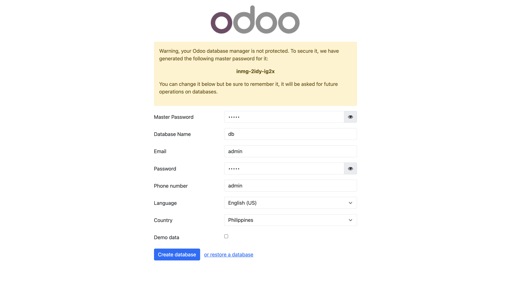
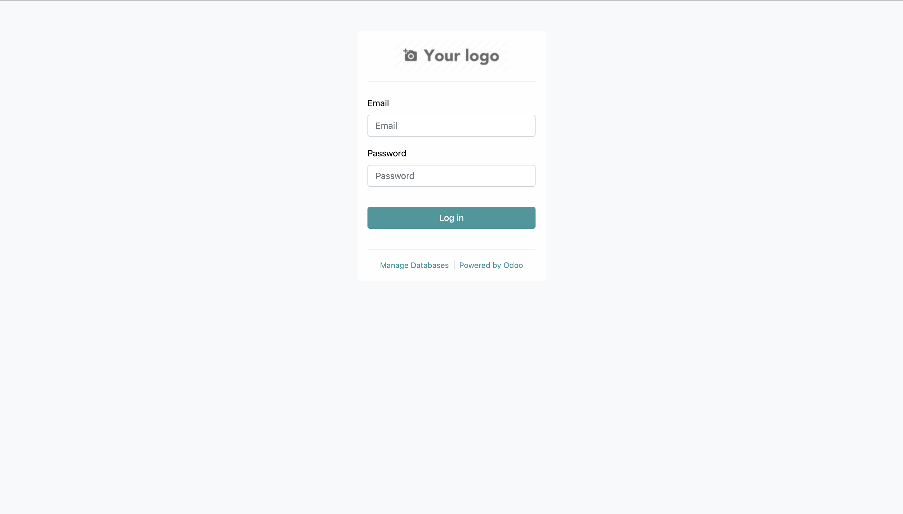
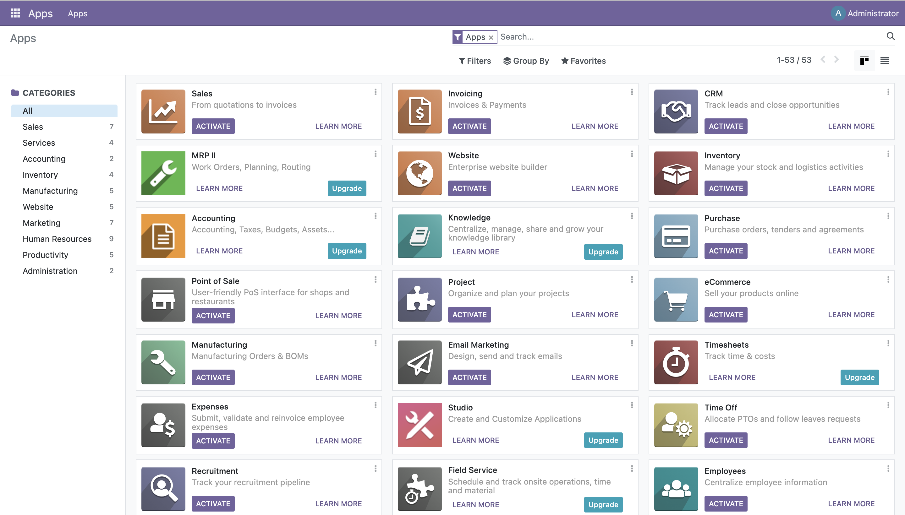
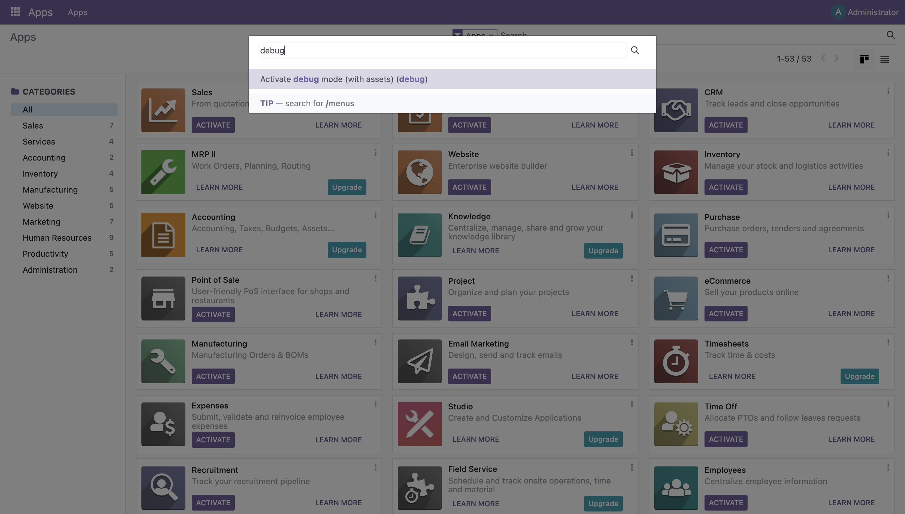
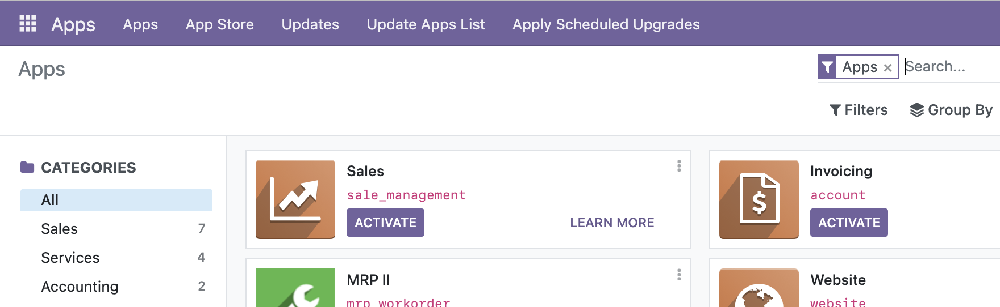

# Using Odoo For the First Time
When entering your local server hosting both your Postgre and Odoo containers, you'll be greeted with this page:

For development purposes, you can supply these credentials with familiar or dummy details. For production, these should be secured however.

Afterwards, you'll be greeted with a login page. Simply supply these with the credentials you entered in the previous page.

You'll be greeted with the dashboard of your Odoo instance.

## Invoking Debug Mode
For more in-depth purposes, especially when creating custom add-ons or modules, summon the command bar by pressing `CTRL + K` or `CMD + K` on Mac. Type `debug` and select the first option.

The page will refresh which should now show additional items in the navigation bar and a "bug" icon to the top right.

