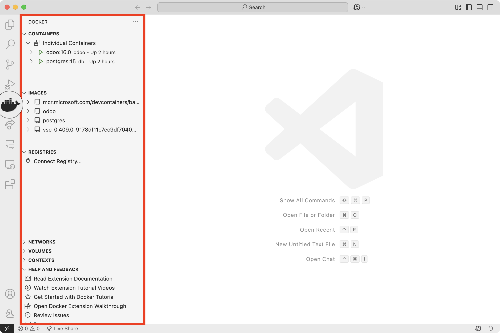
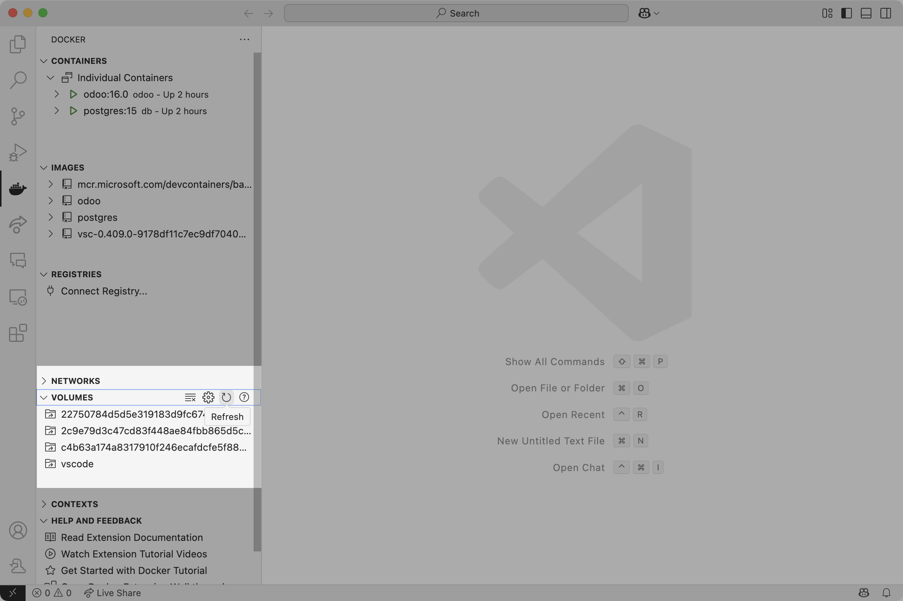
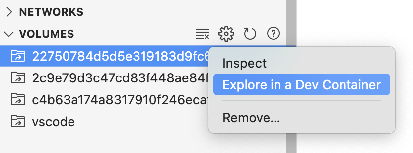
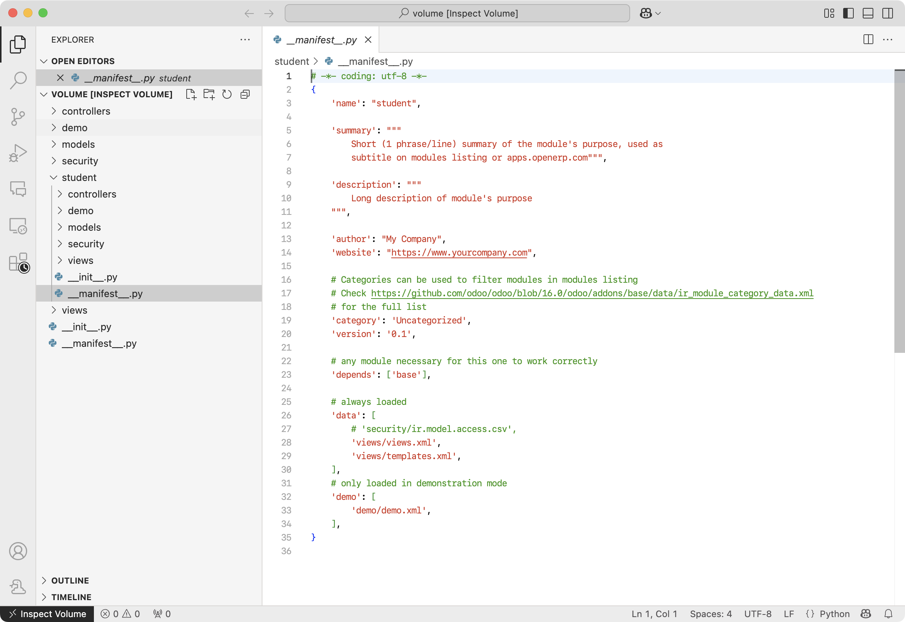

# Setting up Visual Studio Code for Odoo + Docker
**Visual Studio Code** will be the basis for our text editor for this documentation since it offers plugins that will be useful in Odoo development.

## Dependencies
Install the following plugins to Visual Studio Code:

* [Odoo (pre-release)](https://marketplace.visualstudio.com/items/?itemName=Odoo.odoo)
* [Docker](https://marketplace.visualstudio.com/items/?itemName=ms-azuretools.vscode-docker)
* [Dev Containers](https://marketplace.visualstudio.com/items/?itemName=ms-vscode-remote.remote-containers)

After installing, it is important to note that the Docker icon should be visible from VS Code's Primary Side Bar and accessible, showing your containers and images in its default view similar to the image below:

## Editing Files in Containers
While Docker is currently being viewed in the Side Bar, expand **Volumes** and refresh it. It should list all the volumes as they are listed in Docker Desktop, similar to the image below:

Locate the volume where the custom add-ons are located (as shown in [Custom Add-ons of Add-ons and Modules](../addons/intro.md#file-locations) with that file structure), right-click on the volume, and **Explore in Dev Container**.

Afterwards, a new window or the window will be refreshed connecting to that Docker volume. After trusting the files contained in that volume (since the window is refreshed to an entirely new session), your file tree should consist exactly as they were listed in Docker Desktop. You can now edit the files in that volume directly from Visual Studio Code.

Aside from directly editing files, especially custom add-ons, in this manner, you can edit them in your local environment and copy it later to where your custom add-ons will be stored, which will be discussed in the next section.
